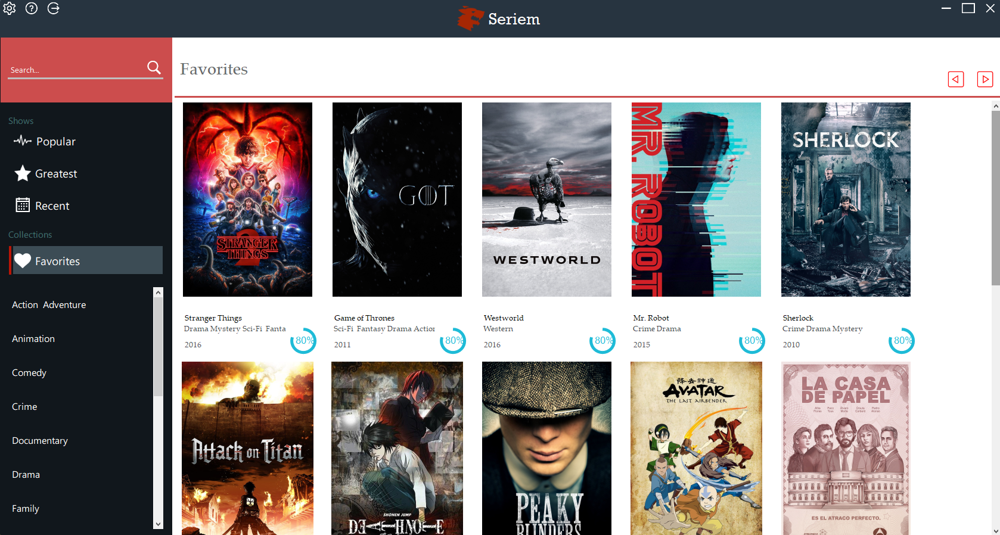
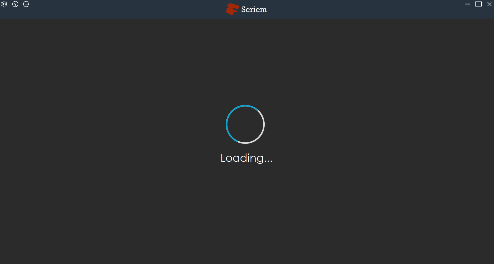
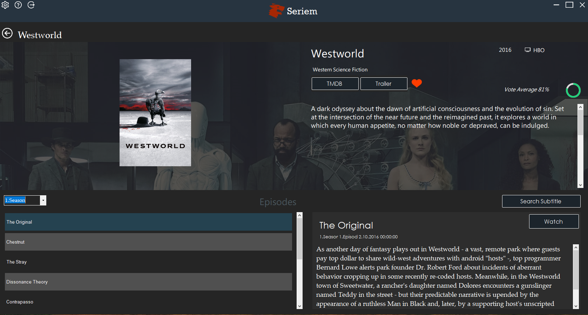
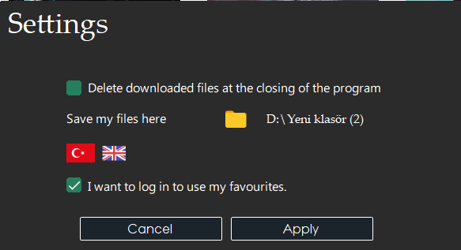
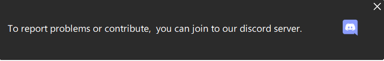

  
 

# Seriem
Seriem is a simple application which lets you watch TV shows instantly.
[Install Latest Version](https://github.com/codirx/Seriem/releases/download/1.0.0/Seriem.msi) - 
I haven't uploaded all series yet. You can join the Seriem's discord from the help button in the Seriem to see the installed series.
# How Does It Work ?
It uses [Peerflix](https://github.com/mafintosh/peerflix) as a torrent engine.
For series information thanks for the awesome API wrapper for TMDB api: [TMDBLib](https://github.com/LordMike/TMDbLib)

# UPLOADED SERIES SO FAR
Stranger Things
 
Elementary  
Game of Thrones 
WestWorld 
Mr. Robot 
Sherlock 
Attack on Titan 
Peaky Blinders 
La Casa De Papel 
Vikings 
The Handmaid's Tale 
MindHunter 
The Expanse 
Black Mirror 
The Wire 

**This project and the distribution of this project is not illegal, nor does it violate any DMCA laws. The use of this project, however, may be illegal in your area. Check your local laws and regulations regarding the use of torrents to watch potentially copyrighted content. The maintainers of this project do not condone the use of this project for anything illegal, in any state, region, country, or planet. Please use at your own risk.**
